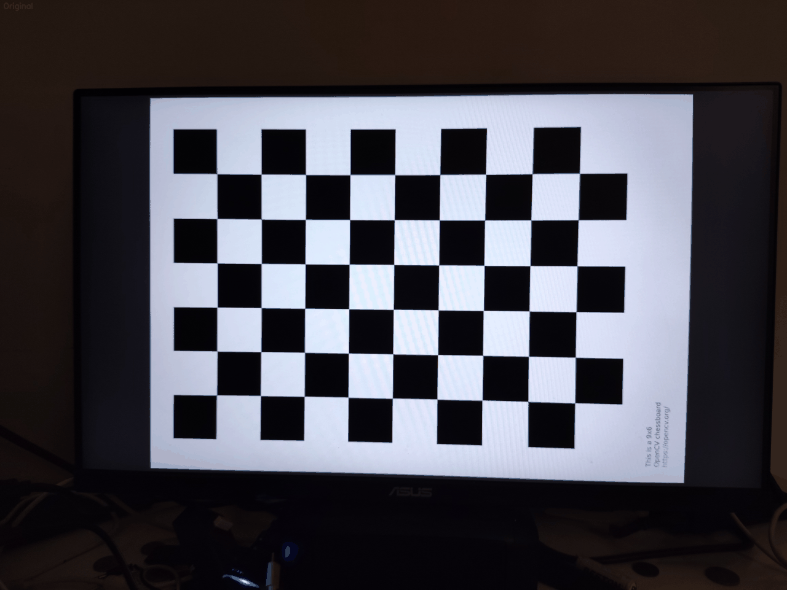
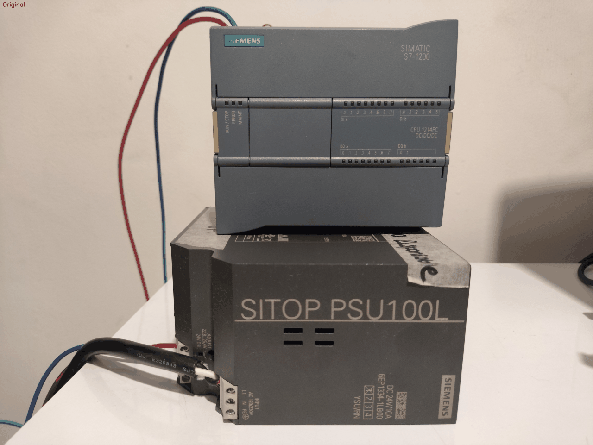

# Trabajo Práctico: Procesamiento Digital de Imágenes

**Autores:**  
- Sebastián Palacio (spalaciob@unal.edu.co)  
- Juan Manuel Sanchez Restrepo (jsanchezrestrepo@unal.edu.co)  
- Henrry Uribe Cabrera Ordonez (hcabrerao@unal.edu.co)  
- Laura Sanin Colorado (lsaninc@unal.edu.co)

**Fecha:** Octubre 2025

---

## Tabla de Contenidos

1. [Introducción](#1-introducción)
2. [Marco Teórico](#2-marco-teórico)
3. [Calibración de Cámaras](#3-calibración-de-cámaras)
4. [Transformaciones de Intensidad](#4-transformaciones-de-intensidad)
5. [Transformaciones Geométricas](#5-transformaciones-geométricas)
6. [Distribución de Intensidades e Histogramas](#6-distribución-de-intensidades-e-histogramas)
7. [Segmentación de Imágenes](#7-segmentación-de-imágenes)
8. [Conclusiones](#8-conclusiones)
9. [Referencias](#9-referencias)

---

## 1. Introducción

### 1.1 Contexto y Motivación

El procesamiento digital de imágenes es fundamental en la visión por computador, con aplicaciones en fotografía, reconocimiento de patrones, navegación autónoma y diagnóstico médico. Sin embargo, las imágenes digitales presentan distorsiones, ruido y artefactos debido a limitaciones ópticas, iluminación y características del sensor. Este trabajo aborda cinco técnicas esenciales: calibración de cámaras, transformaciones de intensidad, transformaciones geométricas, análisis de histogramas y segmentación por color, representando componentes clave del pipeline de procesamiento de imágenes.

### 1.2 Objetivos

Los objetivos específicos de este trabajo práctico son:

1. **Calibrar una cámara real** utilizando un patrón de tablero de ajedrez, determinando los parámetros intrínsecos (matriz de cámara y coeficientes de distorsión) y evaluando la calidad de la calibración.

2. **Aplicar transformaciones de intensidad** a nivel de píxel, incluyendo ajustes de brillo, contraste y operaciones aritméticas entre imágenes.

3. **Implementar transformaciones geométricas** como rotación, traslación y escalado, generando secuencias animadas de las transformaciones.

4. **Analizar distribuciones de intensidad** mediante histogramas y aplicar técnicas de ecualización para mejorar el contraste de las imágenes.

5. **Desarrollar un sistema de segmentación por color** capaz de identificar, contar y medir el área de objetos de diferentes colores en una escena.

---

## 2. Marco Teórico

### 2.1 Modelo de Cámara Pinhole

El modelo matemático fundamental para representar la formación de imágenes en una cámara es el modelo pinhole (cámara estenopeica). En este modelo, la proyección de un punto 3D del mundo $(X, Y, Z)$ a un punto 2D en la imagen $(u, v)$ se describe mediante:

$
\begin{bmatrix} u \\ v \\ 1 \end{bmatrix} = K \begin{bmatrix} R | t \end{bmatrix} \begin{bmatrix} X \\ Y \\ Z \\ 1 \end{bmatrix}
$

donde:

- **K** es la matriz de parámetros intrínsecos de la cámara:
  
$
K = \begin{bmatrix} f_x & 0 & c_x \\ 0 & f_y & c_y \\ 0 & 0 & 1 \end{bmatrix}
$

- $f_x, f_y$: longitudes focales en píxeles en las direcciones x e y
- $c_x, c_y$: coordenadas del punto principal (centro óptico)
- $R$: matriz de rotación 3×3 (parámetros extrínsecos)
- $t$: vector de traslación 3×1 (parámetros extrínsecos)

### 2.2 Distorsión de Lentes

Las lentes reales introducen distorsiones que el modelo pinhole ideal no contempla. Los dos tipos principales son:

#### 2.2.1 Distorsión Radial

Causada por la forma de la lente, especialmente en las regiones alejadas del centro óptico. Se modela mediante:

$
\begin{aligned}
x_{corregido} &= x(1 + k_1 r^2 + k_2 r^4 + k_3 r^6) \\
y_{corregido} &= y(1 + k_1 r^2 + k_2 r^4 + k_3 r^6)
\end{aligned}
$

donde $r^2 = x^2 + y^2$ y $k_1, k_2, k_3$ son los coeficientes de distorsión radial.

- Si $k_1 > 0$: distorsión de **barril** (líneas rectas se curvan hacia afuera)
- Si $k_1 < 0$: distorsión de **cojín** (líneas rectas se curvan hacia adentro)

#### 2.2.2 Distorsión Tangencial

Causada por el desalineamiento entre la lente y el sensor de imagen:

$
\begin{aligned}
x_{corregido} &= x + [2p_1 xy + p_2(r^2 + 2x^2)] \\
y_{corregido} &= y + [p_1(r^2 + 2y^2) + 2p_2 xy]
\end{aligned}
$

donde $p_1, p_2$ son los coeficientes de distorsión tangencial.

### 2.3 Proceso de Calibración

La calibración de cámara consiste en determinar los parámetros intrínsecos (K y coeficientes de distorsión) mediante la observación de un patrón de calibración conocido desde múltiples puntos de vista (Zhang, 2000). El proceso típicamente incluye:

1. **Detección de puntos característicos** en el patrón (esquinas del tablero de ajedrez)
2. **Establecimiento de correspondencias** entre puntos 3D del patrón y puntos 2D en la imagen
3. **Optimización no lineal** para minimizar el error de reproyección

El error de reproyección RMS (Root Mean Square) se define como:

$
E_{RMS} = \sqrt{\frac{1}{n} \sum_{i=1}^{n} \|(u_i, v_i) - \hat{f}(X_i, Y_i, Z_i)\|^2}
$

donde $(u_i, v_i)$ son las coordenadas observadas y $\hat{f}$ es la función de proyección estimada.

### 2.4 Transformaciones de Intensidad

Las transformaciones de intensidad operan sobre los valores de los píxeles de manera independiente:

- **Ajuste de brillo:** $I_{out} = I_{in} + \beta$
- **Ajuste de contraste:** $I_{out} = \alpha \cdot I_{in}$
- **Corrección gamma:** $I_{out} = I_{in}^{\gamma}$

### 2.5 Ecualización de Histograma

La ecualización de histograma redistribuye las intensidades de la imagen para utilizar todo el rango dinámico disponible, mejorando el contraste global. Se basa en la función de distribución acumulada (CDF):

$
h(v) = \text{round}\left(\frac{\text{CDF}(v) - \text{CDF}_{min}}{(M \times N) - \text{CDF}_{min}} \times (L-1)\right)
$

donde $M \times N$ es el tamaño de la imagen y $L$ es el número de niveles de intensidad.

### 2.6 Segmentación por Color

La segmentación por color separa una imagen en regiones basándose en similitudes de color. El espacio de color HSV (Hue, Saturation, Value) es particularmente útil porque:

- **Hue (Matiz):** representa el color puro (0-180° en OpenCV)
- **Saturation (Saturación):** intensidad del color (0-255)
- **Value (Valor):** brillo del color (0-255)

Este espacio facilita la segmentación porque el matiz es más robusto a cambios de iluminación que RGB.

---

## 3. Calibración de Cámaras

### 3.1 Metodología

#### 3.1.1 Materiales y Equipamiento

Para la calibración de la cámara se utilizaron:

- Cámara de Xiaomi Poco X6 en modo PRO
- Patrón de calibración tipo tablero de ajedrez de 9×6 esquinas internas
- Monitor de computadora para mostrar el patrón (evita problemas de iluminación)
- Patrón impreso en papel (para comparación)

#### 3.1.2 Captura de Imágenes

Se capturaron múltiples conjuntos de imágenes del patrón de calibración bajo diferentes condiciones:

1. **Conjunto `images/`:** 24 imágenes del patrón mostrado en monitor, con buena iluminación y variedad de ángulos y distancias
2. **Conjunto `images3/`:** 24 imágenes del patrón impreso en papel, con iluminación menos controlada
3. **Conjunto `images_opencv/`:** Imágenes de baja resolución (640×480) del dataset de OpenCV
4. **Conjunto `images_resized_1438x1080/`:** Imágenes redimensionadas para comparar efectos de resolución

#### 3.1.3 Implementación del Algoritmo

El proceso de calibración se implementó utilizando OpenCV (Bradski & Kaehler, 2008) siguiendo cuatro pasos principales: 
1. Definición del patrón de calibración de 9×6 esquinas internas, 
2. Preparación de los puntos 3D del objeto con coordenadas conocidas, 
3. Detección y refinamiento de esquinas en cada imagen mediante `cv2.findChessboardCorners()` y `cv2.cornerSubPix()`, 
4. Calibración de la cámara mediante `cv2.calibrateCamera()` que realiza una optimización no lineal para minimizar el error de reproyección.

#### 3.1.4 Métricas de Evaluación

Además del error RMS estándar, se implementó una métrica de error porcentual respecto a la diagonal de la imagen:

$
\text{Error\%} = \frac{\text{Error RMS}}{\sqrt{w^2 + h^2}} \times 100
$

Esta métrica permite comparar calibraciones de imágenes con diferentes resoluciones de manera justa.

### 3.2 Resultados

#### 3.2.1 Parámetros Intrínsecos - Calibración Principal (images/)

La calibración con el conjunto `images/` (patrón en monitor, alta calidad) produjo los siguientes parámetros:

**Matriz de Cámara (K):**

```
K = [[3461.26    0.00  2292.76]
     [   0.00 3460.26  1760.17]
     [   0.00    0.00     1.00]]
```

**Coeficientes de Distorsión:**

```
[k1, k2, p1, p2, k3] = [0.136, -0.344, -0.001, 0.001, 0.169]
```

**Métricas de Error:**

- Error RMS: 1.2306 píxeles
- Error porcentual (respecto a diagonal): 0.0213%

#### 3.2.3 Análisis de los Parámetros

##### Longitudes Focales (fx, fy)

- $f_x \approx 3461$ píxeles
- $f_y \approx 3460$ píxeles

La similitud entre $f_x$ y $f_y$ (diferencia < 0.03%) indica que:

1. Los píxeles del sensor son prácticamente cuadrados (aspect ratio ≈ 1)
2. No hay distorsión de aspecto significativa
3. El sensor está correctamente alineado

Los valores elevados de las longitudes focales reflejan la alta resolución de la imagen capturada y una distancia focal relativamente grande de la cámara del smartphone.

##### Punto Principal (cx, cy)

- Centro óptico estimado: (2292.76, 1760.17)
- Centro geométrico de la imagen: (2312.0, 1736.0)
- Desplazamiento en X: ~19 píxeles (~0.4% del ancho)
- Desplazamiento en Y: ~24 píxeles (~0.7% de la altura)

El punto principal está muy cerca del centro geométrico, lo que indica un buen ensamblaje de la cámara. Pequeñas desviaciones son normales y esperadas en cámaras reales.

##### Coeficientes de Distorsión

El coeficiente \(k_1 = 0.136 > 0\) indica **distorsión de barril**, característica típica de lentes angulares en smartphones. Los coeficientes de distorsión tangencial (\(p_1, p_2\)) son muy pequeños (~0.001), indicando un buen alineamiento entre la lente y el sensor.

#### 3.2.4 Comparación de Calibraciones

Se realizaron calibraciones con diferentes conjuntos de imágenes para evaluar el impacto de la calidad de imagen y la resolución:

| Conjunto | Resolución | Error RMS (px) | Error Porcentual (%) | Calidad Visual de Corrección |
|----------|-----------|----------------|----------------------|------------------------------|
| `images_resized_1438x1080/` | 1438×1080 | 0.3292 | 0.0183 | Excelente |
| `images/` | 4624×3472 | 1.2306 | 0.0213 | Buena |
| `images3/` | 4624×3472 | 1.3433 | 0.0232 | Regular (sobreajuste) |
| `images_opencv/` | 640×480 | 0.2603 | 0.0325 | Buena |

##### Observaciones Importantes:

1. **Importancia del error relativo:** Comparar el error porcentual respecto a la diagonal es más justo que usar el error RMS absoluto, ya que permite evaluar calibraciones de distinta resolución de manera significativa. Un error RMS bajo no garantiza mejor precisión relativa.

2. **Importancia de la calidad de imagen:** A pesar de tener la misma resolución, `images/` (patrón en monitor) produjo mejor corrección que `images3/` (patrón impreso). Esto demuestra que la iluminación uniforme y el contraste son críticos para una buena calibración.

#### 3.2.5 Corrección de Distorsión

Se aplicó la corrección de distorsión a las imágenes utilizando los parámetros calibrados, generando GIFs comparativos alternando entre imágenes originales y corregidas, donde se aprecia claramente el efecto de la corrección.

<p align="center">
    
</p>

**Resultados visuales:**

- Las líneas rectas en las esquinas y bordes de la imagen, que aparecían curvadas en la imagen original, se vuelven rectas en la imagen corregida
- La corrección es especialmente notable en objetos con líneas verticales u horizontales
- En las esquinas de las imágenes corregidas se observa un ligero estiramiento, que es el efecto esperado al "empujar" los píxeles hacia afuera para enderezar las líneas curvadas


#### 3.2.6 Validación con Imágenes de Prueba

Se validó la calibración aplicándola a fotos tomadas con la misma cámara, como una imagen de un PLC con líneas verticales, comprobando la corrección efectiva de la distorsión.

<p align="center">
    
</p>

- **Imagen original:** Las líneas verticales del PLC muestran curvatura debido a la distorsión de barril
- **Imagen corregida:** Las líneas verticales se vuelven rectas, validando la efectividad de la calibración

Esto confirma que los parámetros calibrados pueden aplicarse exitosamente a cualquier imagen capturada con la misma cámara bajo configuraciones similares.

### 3.3 Conclusiones de la Calibración

1. Se logró una calibración de buena calidad (error RMS: 1.231 px, error porcentual: 0.0213%) utilizando imágenes de alta resolución con iluminación controlada.

2. La cámara del smartphone presenta distorsión de barril moderada ($k_1 = 0.136$), típica de lentes angulares, que fue correctamente caracterizada y corregida.

3. La calidad de las imágenes de calibración (especialmente la iluminación) es más importante que la cantidad para obtener buenos resultados.

4. El error RMS absoluto es inadecuado para comparar calibraciones de diferentes resoluciones. Se propone el error porcentual respecto a la diagonal como métrica más justa.

5. Los parámetros calibrados permiten corregir efectivamente la distorsión en imágenes independientes, validando la utilidad práctica de la calibración.

---

## 4. Transformaciones de Intensidad


---

## 5. Transformaciones Geométricas


---

## 6. Distribución de Intensidades e Histogramas


---

## 7. Segmentación de Imágenes


---

## 8. Conclusiones

### 8.1 Calibración de Cámaras

- La calibración de cámara es un proceso fundamental que permite corregir distorsiones ópticas y establecer la relación entre el mundo 3D y las coordenadas 2D de la imagen.

- Se logró una calibración de excelente calidad utilizando un patrón de tablero de ajedrez y el algoritmo de Zhang implementado en OpenCV.

- La calidad de las imágenes de calibración (iluminación, enfoque, diversidad de poses) es crítica para obtener buenos resultados.

- Se propone el uso de error relativo (porcentual respecto a la diagonal) como métrica más representativa que el error absoluto en píxeles.

---

## 9. Referencias

OpenCV Documentation. (2024). Camera Calibration and 3D Reconstruction. Recuperado de https://docs.opencv.org/4.x/d9/d0c/group__calib3d.html

Zhang, Z. (2000). A flexible new technique for camera calibration. *IEEE Transactions on Pattern Analysis and Machine Intelligence*, 22(11), 1330-1334. https://doi.org/10.1109/34.888718

---

## 10. Reporte de Contribución Individual

| Nombre | Contribución |
|--------|--------------|
| Sebastián Palacio | Calibración de cámara y reporte técnico |
| Juan Manuel Sanchez Restrepo | Transformaciones de intensidad y reporte técnico |
| Henrry Uribe Cabrera Ordonez | Transformaciones geométricas, distribución de intensidades e histogramas y reporte técnico|
| Laura Sanin Colorado | Segmentación de imágenes y reporte técnico |