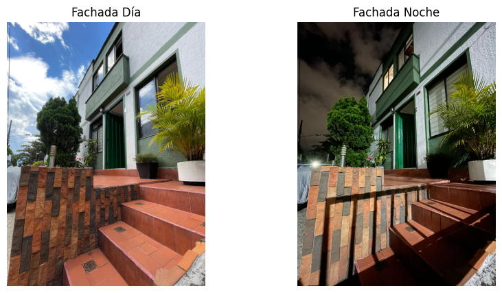
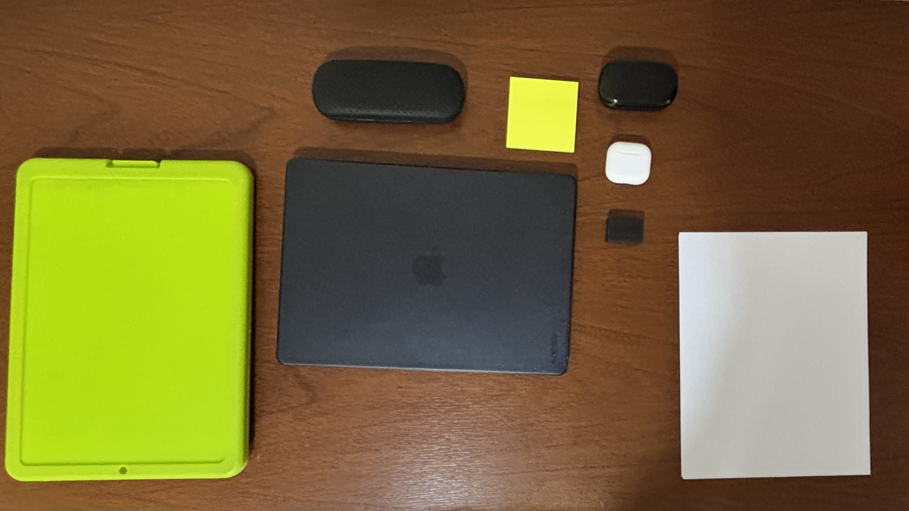

# Trabajo Práctico: Procesamiento Digital de Imágenes

**Autores:**  
- Sebastián Palacio (spalaciob@unal.edu.co)  
- Juan Manuel Sanchez Restrepo (jsanchezrestrepo@unal.edu.co)  
- Henrry Uribe Cabrera Ordonez (hcabrerao@unal.edu.co)  
- Laura Sanin Colorado (lsaninc@unal.edu.co)

**Fecha:** Octubre 2025

---

## Tabla de Contenidos

1. [Introducción](#1-introducción)
2. [Marco Teórico](#2-marco-teórico)
3. [Calibración de Cámaras](#3-calibración-de-cámaras)
4. [Transformaciones de Intensidad](#4-transformaciones-de-intensidad)
5. [Transformaciones Geométricas](#5-transformaciones-geométricas)
6. [Distribución de Intensidades e Histogramas](#6-distribución-de-intensidades-e-histogramas)
7. [Segmentación de Imágenes](#7-segmentación-de-imágenes)
8. [Conclusiones](#8-conclusiones)
9. [Referencias](#9-referencias)

---

## 1. Introducción

### 1.1 Contexto y Motivación

El procesamiento digital de imágenes es fundamental en la visión por computador, con aplicaciones en fotografía, reconocimiento de patrones, navegación autónoma y diagnóstico médico. Sin embargo, las imágenes digitales presentan distorsiones, ruido y artefactos debido a limitaciones ópticas, iluminación y características del sensor. Este trabajo aborda cinco técnicas esenciales: calibración de cámaras, transformaciones de intensidad, transformaciones geométricas, análisis de histogramas y segmentación por color, representando componentes clave del pipeline de procesamiento de imágenes.

### 1.2 Objetivos

Los objetivos específicos de este trabajo práctico son:

1. **Calibrar una cámara real** utilizando un patrón de tablero de ajedrez, determinando los parámetros intrínsecos (matriz de cámara y coeficientes de distorsión) y evaluando la calidad de la calibración.

2. **Aplicar transformaciones de intensidad** a nivel de píxel, incluyendo ajustes de brillo, contraste y operaciones aritméticas entre imágenes.

3. **Implementar transformaciones geométricas** como rotación, traslación y escalado, generando secuencias animadas de las transformaciones.

4. **Analizar distribuciones de intensidad** mediante histogramas y aplicar técnicas de ecualización para mejorar el contraste de las imágenes.

5. **Desarrollar un sistema de segmentación por color** capaz de identificar, contar y medir el área de objetos de diferentes colores en una escena.

---

## 2. Marco Teórico

### 2.1 Modelo de Cámara Pinhole

El modelo matemático fundamental para representar la formación de imágenes en una cámara es el modelo pinhole (cámara estenopeica). En este modelo, la proyección de un punto 3D del mundo $(X, Y, Z)$ a un punto 2D en la imagen $(u, v)$ se describe mediante:

$
\begin{bmatrix} u \\ v \\ 1 \end{bmatrix} = K \begin{bmatrix} R | t \end{bmatrix} \begin{bmatrix} X \\ Y \\ Z \\ 1 \end{bmatrix}
$

donde:

- **K** es la matriz de parámetros intrínsecos de la cámara:
  
$
K = \begin{bmatrix} f_x & 0 & c_x \\ 0 & f_y & c_y \\ 0 & 0 & 1 \end{bmatrix}
$

- $f_x, f_y$: longitudes focales en píxeles en las direcciones x e y
- $c_x, c_y$: coordenadas del punto principal (centro óptico)
- $R$: matriz de rotación 3×3 (parámetros extrínsecos)
- $t$: vector de traslación 3×1 (parámetros extrínsecos)

### 2.2 Distorsión de Lentes

Las lentes reales introducen distorsiones que el modelo pinhole ideal no contempla. Los dos tipos principales son:

#### 2.2.1 Distorsión Radial

Causada por la forma de la lente, especialmente en las regiones alejadas del centro óptico. Se modela mediante:

$
\begin{aligned}
x_{corregido} &= x(1 + k_1 r^2 + k_2 r^4 + k_3 r^6) \\
y_{corregido} &= y(1 + k_1 r^2 + k_2 r^4 + k_3 r^6)
\end{aligned}
$

donde $r^2 = x^2 + y^2$ y $k_1, k_2, k_3$ son los coeficientes de distorsión radial.

- Si $k_1 > 0$: distorsión de **barril** (líneas rectas se curvan hacia afuera)
- Si $k_1 < 0$: distorsión de **cojín** (líneas rectas se curvan hacia adentro)

#### 2.2.2 Distorsión Tangencial

Causada por el desalineamiento entre la lente y el sensor de imagen:

$
\begin{aligned}
x_{corregido} &= x + [2p_1 xy + p_2(r^2 + 2x^2)] \\
y_{corregido} &= y + [p_1(r^2 + 2y^2) + 2p_2 xy]
\end{aligned}
$

donde $p_1, p_2$ son los coeficientes de distorsión tangencial.

### 2.3 Proceso de Calibración

La calibración de cámara consiste en determinar los parámetros intrínsecos (K y coeficientes de distorsión) mediante la observación de un patrón de calibración conocido desde múltiples puntos de vista (Zhang, 2000). El proceso típicamente incluye:

1. **Detección de puntos característicos** en el patrón (esquinas del tablero de ajedrez)
2. **Establecimiento de correspondencias** entre puntos 3D del patrón y puntos 2D en la imagen
3. **Optimización no lineal** para minimizar el error de reproyección

El error de reproyección RMS (Root Mean Square) se define como:

$
E_{RMS} = \sqrt{\frac{1}{n} \sum_{i=1}^{n} \|(u_i, v_i) - \hat{f}(X_i, Y_i, Z_i)\|^2}
$

donde $(u_i, v_i)$ son las coordenadas observadas y $\hat{f}$ es la función de proyección estimada.

### 2.4 Transformaciones de Intensidad

Las transformaciones de intensidad son operaciones que modifican los valores de los píxeles de una imagen de manera independiente, sin considerar la información espacial de los píxeles vecinos. Estas transformaciones son fundamentales en el procesamiento digital de imágenes para mejorar la calidad visual, corregir problemas de iluminación y preparar imágenes para análisis posteriores.

#### 2.4.1 Ajuste de Brillo

El ajuste de brillo modifica la luminosidad general de la imagen mediante la suma de una constante:

$I_{out} = I_{in} + \beta$

donde $\beta$ es el valor de brillo añadido. Valores positivos aclaran la imagen, mientras que valores negativos la oscurecen. Esta transformación es lineal y afecta uniformemente todos los píxeles.

#### 2.4.2 Ajuste de Contraste

El ajuste de contraste modifica la diferencia entre las intensidades claras y oscuras:

$I_{out} = \alpha \cdot I_{in}$

donde $\alpha$ es el factor de contraste. Valores $\alpha > 1$ aumentan el contraste, mientras que $0 < \alpha < 1$ lo reducen. Esta transformación lineal puede causar saturación en los extremos del rango de intensidades.

#### 2.4.3 Corrección Gamma

La corrección gamma es una transformación no lineal que ajusta la respuesta de intensidad de la imagen:

$I_{out} = I_{in}^{\gamma}$

donde $\gamma$ es el parámetro gamma. Esta transformación es particularmente útil para:
- $\gamma < 1$: Aclarar imágenes oscuras y revelar detalles en sombras
- $\gamma = 1$: Sin cambios (transformación identidad)
- $\gamma > 1$: Oscurecer imágenes y mejorar el contraste en regiones iluminadas

#### 2.4.4 Operaciones Aritméticas Entre Imágenes

Las operaciones aritméticas entre imágenes permiten combinar información de múltiples fuentes:

- **Suma:** $C = A + B$ - Combina información, puede causar saturación
- **Resta:** $C = A - B$ - Resalta diferencias entre imágenes
- **Multiplicación:** $C = A \cdot B$ - Efecto de enmascaramiento
- **División:** $C = A / B$ - Normalización y detección de cambios

Estas operaciones requieren manejo cuidadoso de la saturación y la división por cero.

### 2.5 Ecualización de Histograma

La ecualización de histograma redistribuye las intensidades de la imagen para utilizar todo el rango dinámico disponible, mejorando el contraste global. Se basa en la función de distribución acumulada (CDF):

$
h(v) = \text{round}\left(\frac{\text{CDF}(v) - \text{CDF}_{min}}{(M \times N) - \text{CDF}_{min}} \times (L-1)\right)
$

donde $M \times N$ es el tamaño de la imagen y $L$ es el número de niveles de intensidad.

### 2.6 Segmentación por Color

#### 2.6.1 Fundamentos de color

La **segmentación por color** separa una imagen en regiones basándose en similitudes cromáticas.  
El **espacio de color HSV (Hue, Saturation, Value)** es particularmente útil porque desacopla el color puro de la iluminación:

- **Hue (Matiz):** representa el color puro (0–180° en OpenCV)  
- **Saturation (Saturación):** intensidad o pureza del color (0–255)  
- **Value (Valor):** brillo o luminosidad (0–255)

Este espacio facilita la segmentación porque el **matiz es más robusto a variaciones de iluminación** que el modelo RGB, permitiendo una umbralización más estable y generalizable entre imágenes con diferentes condiciones de luz.

El espacio **Lab**, por su parte, es perceptualmente uniforme e independiente del dispositivo, lo que lo hace ideal para análisis cromáticos más precisos.  

#### 2.6.2 Filtrado Gaussiano
- Reduce ruido sin eliminar bordes importantes.  
- Parámetro clave: desviación estándar (σ).  

#### 2.6.3 Detección de bordes
- **Sobel:** calcula derivadas espaciales.  
- **Canny:** suavizado → gradiente → supresión no máxima → histéresis.

#### 2.6.4 Morfología matemática
- **Apertura:** elimina ruido pequeño.  
- **Cierre:** rellena huecos.  
- **Dilatación/Erosión:** controlan grosor de regiones.  
- **Gradiente:** diferencia entre dilatación y erosión → resalta bordes.

#### 2.6.5 Transformada de distancia
- Mide distancia desde cada píxel del objeto al fondo.  
- Los máximos locales se usan como marcadores para *Watershed*.

#### 2.6.6. Algoritmo Watershed
- Interpreta la imagen como una topografía.  
- Inunda desde los marcadores hasta que las “cuencas” se encuentran, delimitando objetos.

---

## 3. Calibración de Cámaras

### 3.1 Metodología

#### 3.1.1 Materiales y Equipamiento

Para la calibración de la cámara se utilizaron:

- Cámara de Xiaomi Poco X6 en modo PRO
- Patrón de calibración tipo tablero de ajedrez de 9×6 esquinas internas
- Monitor de computadora para mostrar el patrón (evita problemas de iluminación)
- Patrón impreso en papel (para comparación)

#### 3.1.2 Captura de Imágenes

Se capturaron múltiples conjuntos de imágenes del patrón de calibración bajo diferentes condiciones:

1. **Conjunto `images/`:** 24 imágenes del patrón mostrado en monitor, con buena iluminación y variedad de ángulos y distancias
2. **Conjunto `images3/`:** 24 imágenes del patrón impreso en papel, con iluminación menos controlada
3. **Conjunto `images_opencv/`:** Imágenes de baja resolución (640×480) del dataset de OpenCV
4. **Conjunto `images_resized_1438x1080/`:** Imágenes redimensionadas para comparar efectos de resolución

#### 3.1.3 Implementación del Algoritmo

El proceso de calibración se implementó utilizando OpenCV (Bradski & Kaehler, 2008) siguiendo cuatro pasos principales: 
1. Definición del patrón de calibración de 9×6 esquinas internas, 
2. Preparación de los puntos 3D del objeto con coordenadas conocidas, 
3. Detección y refinamiento de esquinas en cada imagen mediante `cv2.findChessboardCorners()` y `cv2.cornerSubPix()`, 
4. Calibración de la cámara mediante `cv2.calibrateCamera()` que realiza una optimización no lineal para minimizar el error de reproyección.

#### 3.1.4 Métricas de Evaluación

Además del error RMS estándar, se implementó una métrica de error porcentual respecto a la diagonal de la imagen:

$
\text{Error\%} = \frac{\text{Error RMS}}{\sqrt{w^2 + h^2}} \times 100
$

Esta métrica permite comparar calibraciones de imágenes con diferentes resoluciones de manera justa.

### 3.2 Resultados

#### 3.2.1 Parámetros Intrínsecos - Calibración Principal (images/)

La calibración con el conjunto `images/` (patrón en monitor, alta calidad) produjo los siguientes parámetros:

**Matriz de Cámara (K):**

```
K = [[3461.26    0.00  2292.76]
     [   0.00 3460.26  1760.17]
     [   0.00    0.00     1.00]]
```

**Coeficientes de Distorsión:**

```
[k1, k2, p1, p2, k3] = [0.136, -0.344, -0.001, 0.001, 0.169]
```

**Métricas de Error:**

- Error RMS: 1.2306 píxeles
- Error porcentual (respecto a diagonal): 0.0213%

#### 3.2.2 Análisis de los Parámetros

##### Longitudes Focales (fx, fy)

- $f_x \approx 3461$ píxeles
- $f_y \approx 3460$ píxeles

La similitud entre $f_x$ y $f_y$ (diferencia < 0.03%) indica que:

1. Los píxeles del sensor son prácticamente cuadrados (aspect ratio ≈ 1)
2. No hay distorsión de aspecto significativa
3. El sensor está correctamente alineado

Los valores elevados de las longitudes focales reflejan la alta resolución de la imagen capturada y una distancia focal relativamente grande de la cámara del smartphone.

##### Punto Principal (cx, cy)

- Centro óptico estimado: (2292.76, 1760.17)
- Centro geométrico de la imagen: (2312.0, 1736.0)
- Desplazamiento en X: ~19 píxeles (~0.4% del ancho)
- Desplazamiento en Y: ~24 píxeles (~0.7% de la altura)

El punto principal está muy cerca del centro geométrico, lo que indica un buen ensamblaje de la cámara. Pequeñas desviaciones son normales y esperadas en cámaras reales.

##### Coeficientes de Distorsión

El coeficiente $k_1 = 0.136 > 0$ indica **distorsión de barril**, característica típica de lentes angulares en smartphones. Los coeficientes de distorsión tangencial $p_1, p_2$ son muy pequeños (~0.001), indicando un buen alineamiento entre la lente y el sensor.

#### 3.2.3 Comparación de Calibraciones

Se realizaron calibraciones con diferentes conjuntos de imágenes para evaluar el impacto de la calidad de imagen y la resolución:

| Conjunto | Resolución | Error RMS (px) | Error Porcentual (%) | Calidad Visual de Corrección |
|----------|-----------|----------------|----------------------|------------------------------|
| `images_resized_1438x1080/` | 1438×1080 | 0.3292 | 0.0183 | Excelente |
| `images/` | 4624×3472 | 1.2306 | 0.0213 | Buena |
| `images3/` | 4624×3472 | 1.3433 | 0.0232 | Regular (sobreajuste) |
| `images_opencv/` | 640×480 | 0.2603 | 0.0325 | Buena |

##### Observaciones Importantes:

1. **Importancia del error relativo:** Comparar el error porcentual respecto a la diagonal es más justo que usar el error RMS absoluto, ya que permite evaluar calibraciones de distinta resolución de manera significativa. Un error RMS bajo no garantiza mejor precisión relativa.

2. **Importancia de la calidad de imagen:** A pesar de tener la misma resolución, `images/` (patrón en monitor) produjo mejor corrección que `images3/` (patrón impreso). Esto demuestra que la iluminación uniforme y el contraste son críticos para una buena calibración.

#### 3.2.4 Corrección de Distorsión

Se aplicó la corrección de distorsión a las imágenes utilizando los parámetros calibrados, generando GIFs comparativos alternando entre imágenes originales y corregidas, donde se aprecia claramente el efecto de la corrección.

<p align="center">
    
</p>

**Resultados visuales:**

- Las líneas rectas en las esquinas y bordes de la imagen, que aparecían curvadas en la imagen original, se vuelven rectas en la imagen corregida
- La corrección es especialmente notable en objetos con líneas verticales u horizontales
- En las esquinas de las imágenes corregidas se observa un ligero estiramiento, que es el efecto esperado al "empujar" los píxeles hacia afuera para enderezar las líneas curvadas


#### 3.2.5 Validación con Imágenes de Prueba

Se validó la calibración aplicándola a fotos tomadas con la misma cámara, como una imagen de un PLC con líneas verticales, comprobando la corrección efectiva de la distorsión.

<p align="center">
    
</p>

- **Imagen original:** Las líneas verticales del PLC muestran curvatura debido a la distorsión de barril
- **Imagen corregida:** Las líneas verticales se vuelven rectas, validando la efectividad de la calibración

Esto confirma que los parámetros calibrados pueden aplicarse exitosamente a cualquier imagen capturada con la misma cámara bajo configuraciones similares.

### 3.3 Conclusiones de la Calibración

1. Se logró una calibración de buena calidad (error RMS: 1.231 px, error porcentual: 0.0213%) utilizando imágenes de alta resolución con iluminación controlada.

2. La cámara del smartphone presenta distorsión de barril moderada ($k_1 = 0.136$), típica de lentes angulares, que fue correctamente caracterizada y corregida.

3. La calidad de las imágenes de calibración (especialmente la iluminación) es más importante que la cantidad para obtener buenos resultados.

4. El error RMS absoluto es inadecuado para comparar calibraciones de diferentes resoluciones. Se propone el error porcentual respecto a la diagonal como métrica más justa.

5. Los parámetros calibrados permiten corregir efectivamente la distorsión en imágenes independientes, validando la utilidad práctica de la calibración.

---

## 4. Transformaciones de Intensidad

### 4.1 Metodología

#### 4.1.1 Materiales y Equipamiento

Para la implementación de transformaciones de intensidad se utilizaron dos fotografías de la misma fachada capturadas en condiciones de iluminación diurna y nocturna con el mismo encuadre.

<p align="center">
    
</p>


#### 4.1.2 Implementación de las Transformaciones

Se implementaron cuatro tipos de transformaciones de intensidad a nivel de píxel:

##### 4.1.2.1 Ajuste de Brillo

Se aplicó la transformación lineal: $I_{out} = I_{in} + \beta$

Donde $\beta$ es el valor de brillo añadido. Se probaron tres niveles: 50, 100 y 150.

##### 4.1.2.2 Ajuste de Contraste

Se implementó la transformación: $I_{out} = \alpha \cdot I_{in}$

Donde $\alpha$ es el factor de contraste. Se evaluaron valores de 1.4, 2 y 3.

##### 4.1.2.3 Corrección Gamma

Se aplicó la transformación no lineal: $I_{out} = I_{in}^{\gamma}$

Se probaron valores de gamma: 0.5, 1.0 y 1.7.

##### 4.1.2.4 Operaciones Aritméticas Entre Imágenes

Se realizaron operaciones elemento a elemento entre las imágenes de día y noche:
- Suma: $C = A + B$
- Resta: $C = A - B$  
- Multiplicación: $C = A \cdot B$
- División: $C = A / B$ (con manejo de división por cero)

#### 4.1.3 Métricas de Evaluación

Se realizó una evaluación cualitativa visual analizando:
- Preservación de detalles en diferentes regiones de la imagen
- Efectos de saturación y pérdida de información
- Diferencias en el comportamiento entre imágenes diurnas y nocturnas
- Aparición de artefactos o distorsiones

### 4.2 Resultados

#### 4.2.1 Ajuste de Brillo

**Resultados por nivel de brillo:**

- **β = 50:** Mejora la visibilidad en zonas oscuras sin saturar áreas claras. Efecto moderado y controlado.
- **β = 100:** Aclara notablemente la imagen, pero comienzan a perderse detalles en regiones ya iluminadas, especialmente en la imagen de día.
- **β = 150:** Provoca saturación generalizada, predominio de blancos y pérdida de información en ambas imágenes.

**Comparación día/noche:** El mismo parámetro afecta de manera diferente según la imagen original. En la imagen de día, el aumento de brillo produce saturación rápida en zonas claras. En la imagen de noche, el incremento revela detalles en áreas oscuras, pero las zonas previamente iluminadas por lámparas se saturan antes que en la imagen de día.

#### 4.2.2 Ajuste de Contraste

**Resultados por factor de contraste:**

- **α = 1.4:** La imagen mantiene detalle y mejora la percepción de texturas. Mejora moderada del contraste.
- **α = 2:** Las áreas claras se vuelven mucho más brillantes y las oscuras más profundas, perdiéndose información en ambos extremos.
- **α = 3:** La saturación es extrema: predominan blancos y negros, desaparecen gradientes y se pierde información visual relevante.

**Comparación día/noche:** En la imagen de día, el aumento de contraste provoca saturación rápida en cielos y paredes claras. En la imagen de noche, las zonas iluminadas por lámparas se saturan antes, generando áreas blancas sin detalle, mientras que las sombras se vuelven completamente negras.

#### 4.2.3 Corrección Gamma

**Resultados por valor de gamma:**

- **γ = 0.5:** Aclara considerablemente la imagen, revelando detalles en sombras pero saturando áreas iluminadas.
- **γ = 1.0:** No produce cambios perceptibles (transformación identidad).
- **γ = 1.7:** Oscurece la imagen, intensificando las sombras y perdiendo información en regiones oscuras.

**Comparación día/noche:** El mismo valor de gamma afecta de forma diferente según la distribución de intensidades original. En la imagen de día, la corrección gamma aclara u oscurece de manera más homogénea; en la imagen de noche, los cambios son más drásticos en zonas con iluminación artificial, generando saturación o pérdida de detalle localizada.

#### 4.2.4 Operaciones Aritméticas Entre Imágenes

**Resultados por operación:**

- **Suma (A+B):** La imagen resultante es mucho más brillante, con predominio de zonas claras y tendencia a la saturación en áreas donde ambas imágenes ya tenían alta intensidad. Se pierden detalles en regiones iluminadas y las sombras se atenúan.

- **Resta (A-B):** Resalta las diferencias entre ambas imágenes. Las zonas que son más claras en la imagen de día y oscuras en la de noche aparecen brillantes, mientras que las áreas similares se oscurecen. Se enfatizan los cambios de iluminación y estructura.

- **Multiplicación (A*B):** Oscurece la imagen, ya que solo las zonas donde ambas imágenes tienen valores altos permanecen visibles. Las sombras y áreas oscuras se intensifican, perdiendo información en sectores poco iluminados.

- **División (A/B):** Genera contraste extremo y efectos de saturación, especialmente en zonas donde los valores de la imagen de noche son bajos. Aparecen artefactos y colores irreales en áreas con diferencias grandes de intensidad.


---

## 5. Transformaciones Geométricas


---

## 6. Distribución de Intensidades e Histogramas


---

## 7. Segmentación de imágenes

### 7.1 Metodología

#### 7.1.1 Materiales y Equipamiento

Para la práctica de segmentación por color se emplearon los siguientes elementos:

- **Cámara:** Iphone 15 cámara 0.5
- **Entorno de captura 1:** escritorio con objetos de distintos colores (verde, gris, blanco, negro y amarillo)  
- **Entorno de captura 2:** estantería de la Biblioteca Efe Gómez, Universidad Nacional de Colombia – Sede Medellín  

#### 7.1.2 Imágenes Utilizadas

1. **Imagen 1 — Escritorio:** objetos con colores bien definidos sobre fondo de madera.  
2. **Imagen 2 — Estantería:** libros de múltiples colores y texturas, útiles para probar la robustez del algoritmo.

#### 7.1.3 Implementación del Algoritmo

El procedimiento de segmentación se desarrolló en **Python con OpenCV**, siguiendo los pasos:

##### 7.1.3.1 Lectura y Conversión de la Imagen

Se leyó la imagen en formato BGR (por defecto en OpenCV) y se convirtió al espacio de color HSV mediante la función:

```python
hsv = cv2.cvtColor(img, cv2.COLOR_BGR2HSV)
```

##### 7.1.3.2 Definición de Rangos de Color

Para aislar los colores de interés, se definieron valores mínimos y máximos para cada componente del espacio HSV (tono, saturación y valor):

```python
lower = np.array([H_min, S_min, V_min])
upper = np.array([H_max, S_max, V_max])
```

Estos rangos determinan qué píxeles pertenecen al color objetivo dentro de la imagen.

##### 7.1.3.3 Creación de la Máscara Binaria

Con los valores definidos, se generó una máscara binaria que identifica las regiones de la imagen que cumplen con el rango de color especificado:

```python
mask = cv2.inRange(hsv, lower, upper)
```

##### 7.1.3.4 Aplicación de la Máscara a la Imagen Original

La máscara se aplicó sobre la imagen original para visualizar únicamente las zonas detectadas del color objetivo:

```python
result = cv2.bitwise_and(img, img, mask=mask)
```

##### 7.1.3.5 Filtrado Morfológico y Refinamiento

Se aplicaron operaciones morfológicas de apertura (`cv2.MORPH_OPEN`) para eliminar ruido y suavizar los bordes de las regiones segmentadas:

```python
kernel = np.ones((5,5), np.uint8)
mask_clean = cv2.morphologyEx(mask, cv2.MORPH_OPEN, kernel)
```

##### 7.1.3.6 Espacio de Color Utilizado

El **espacio HSV (Hue, Saturation, Value)** fue elegido por su capacidad para separar la información del color (tono) de la iluminación, permitiendo una segmentación más robusta frente a cambios de luz.

#### 7.1.4 Métricas de Evaluación

Se realizó una **evaluación visual cualitativa**, analizando:

- La precisión en la detección del color objetivo.  
- La exclusión de regiones con tonos similares.  
- La consistencia de los resultados en condiciones lumínicas distintas.  

Además, se estimó la **proporción de píxeles segmentados** como indicador de la extensión del área detectada respecto al total de la imagen.

---

### 7.2 Resultados

El proceso de segmentación implementado evidenció la eficacia de los modelos **HSV** y **Lab** para discriminar objetos en función de sus características cromáticas, aunque su rendimiento dependió significativamente de un **ajuste manual iterativo**. Durante el desarrollo, los rangos de tono, saturación y brillo se refinaron progresivamente mediante inspección visual, ajustando los valores mínimos y máximos hasta alcanzar la mejor separación posible entre los objetos y el fondo. Este enfoque permitió optimizar la precisión de la clasificación frente a colores difusos o con mezclas tonales, siguiendo los lineamientos de **Gonzalez y Woods (2018)**, **Pratt (2007)** y **Sonka, Hlavac y Boyle (2014)**

#### 7.2.1 Segmentación en el Entorno de Escritorio

<p align="center">
    
</p>

Se evaluaron distintos rangos HSV para los colores predominantes:

| Color objetivo | Rango HSV aproximado | Resultado visual |
|----------------|----------------------|------------------|
| Verde (carcasa iPad) | H: [35, 85], S: [50, 255], V: [50, 255] | Segmentación precisa, buen contraste |
| Amarillo (post-it) | H: [20, 40], S: [80, 255], V: [80, 255] | Detección clara con leve ruido por reflejos |
| Blanco (hoja) | H: [0, 180], S: [0, 20], V: [220, 255] | Correcta segmentación bajo buena iluminación |

Para esta escena, pese a la baja resolución, la presencia de sombras y reflejos, el modelo logró una segmentación satisfactoria en cinco categorías cromáticas principales. Las dificultades se presentaron principalmente en las regiones oscuras, donde los tonos negro y marrón de la madera tendían a confundirse por su similitud espectral. Estas limitaciones fueron parcialmente mitigadas mediante el uso del espacio **Lab**, que ofrece una mejor separación perceptual al considerar la distancia estadística entre los canales *a* (verde–rojo) y *b* (azul–amarillo). La aplicación de **operaciones morfológicas** (apertura, cierre y dilatación) permitió eliminar ruido de fondo y consolidar las regiones segmentadas, mejorando la continuidad espacial y la definición de bordes (Burger & Burge, 2016; Russ, 2016).

Además, se implementaron operadores de **gradiente Sobel y Canny** para destacar bordes relevantes, combinados con la **transformada de distancia** y el **algoritmo Watershed**, lo que permitió separar objetos adyacentes manteniendo la integridad de sus contornos. Este enfoque que combina modelos perceptuales y técnicas geométricas, coincide con las recomendaciones de **Bradski y Kaehler (2008)** y **Gonzalez y Woods (2018)**, quienes resaltan la importancia de integrar la interpretación humana y la calibración manual en las etapas iniciales del proceso. La interacción entre observación visual y refinamiento computacional resultó clave para obtener modelos más robustos ante variaciones de color, textura e iluminación, en concordancia con la documentación oficial de **OpenCV (2023)**.

---

#### 7.2.2 Segmentación en la Estantería de la Biblioteca

<p align="center">
    
</p>

Se realizó la segmentación de los tonos **azules** y **verdes** de las carátulas de los libros:

| Color objetivo | Rango HSV aproximado | Observaciones |
|----------------|----------------------|----------------|
| Azul | H: [90, 130], S: [80, 255], V: [60, 255] | Segmentación efectiva en libros con tonos uniformes |
| Verde | H: [40, 80], S: [50, 255], V: [50, 255] | Resultados aceptables; leve confusión con tonos cian |

Las variaciones de brillo y los reflejos afectaron la homogeneidad de la detección, aunque el método permitió distinguir grupos de libros según su color predominante.


#### 7.2.4 Comparación entre escenarios

La comparación entre las fotografías del **escritorio (office)** y la **estantería de la biblioteca (books)** permitió evaluar el comportamiento del algoritmo de segmentación bajo condiciones visuales y estructurales contrastantes.  

En el caso de *office*, la homogeneidad del fondo y la presencia de objetos con colores uniformes y contornos bien definidos (verde-limón, blanco, gris oscuro y negro) facilitaron la calibración de umbrales tanto en el espacio **HSV**. En contraste, la imagen *books* que contiene aproximadamente 168 libros distribuidos en varios estantes representó un desafío mayor debido a su complejidad geométrica, densidad de elementos y similitud cromática entre los libros y la estantería. La interacción entre reflejos, sombras y variaciones de brillo generó un nivel considerable de ruido, afectando la precisión de los bordes y la coherencia de las máscaras, especialmente en tonalidades oscuras como azul y marrón.  

Para mejorar la discriminación, se aplicó un **realce de saturación (books_boosted)** que incrementó el contraste radiométrico entre los colores, seguido de operaciones morfológicas de apertura y cierre. Esta combinación mejoró notablemente la segmentación de los libros, confirmando que el **contraste radiométrico** y la **uniformidad de iluminación** son determinantes para la calidad de la segmentación (Gonzalez & Woods, 2018).  

Asimismo, se comprobó que los **colores cercanos en tono pero distintos en luminancia** tienden a solaparse en el espacio **HSV**, mientras que el modelo **Lab** ofrece una mejor discriminación perceptual gracias a su representación más uniforme del color. Las operaciones morfológicas de apertura y dilatación fueron esenciales para eliminar artefactos residuales, unir regiones fragmentadas y fortalecer la definición de los bordes (Russ, 2016).  

En conjunto, ambos escenarios validaron la efectividad de **combinar métricas perceptuales (HSV–Lab)** con **operaciones morfológicas y gradientes**. Esta estrategia resultó especialmente robusta en escenas simples con objetos bien delimitados, pero su rendimiento disminuyó en entornos con **alta complejidad estructural y tonal**, como la estantería. Futuras mejoras podrían integrar **algoritmos de aprendizaje no supervisado** (*k-means*, *mean shift* o *GMM*) que permitan ajustar los umbrales de color de manera automática, reduciendo la dependencia del ajuste manual y aumentando la reproducibilidad de los resultados (Bradski & Kaehler, 2008).


## 8. Conclusiones

### 8.1 Calibración de Cámaras

- La calibración de cámara es un proceso fundamental que permite corregir distorsiones ópticas y establecer la relación entre el mundo 3D y las coordenadas 2D de la imagen.

- Se logró una calibración de excelente calidad utilizando un patrón de tablero de ajedrez y el algoritmo de Zhang implementado en OpenCV.

- La calidad de las imágenes de calibración (iluminación, enfoque, diversidad de poses) es crítica para obtener buenos resultados.

- Se propone el uso de error relativo (porcentual respecto a la diagonal) como métrica más representativa que el error absoluto en píxeles.

### 8.2 Transformaciones de Intensidad

- Las transformaciones de intensidad son herramientas fundamentales para corregir problemas de iluminación y optimizar el contraste visual.

- Las transformaciones lineales (brillo y contraste) requieren valores moderados para evitar saturación, mientras que la corrección gamma (no lineal) es la más versátil para adaptarse a diferentes distribuciones de intensidad.

- Las operaciones aritméticas entre imágenes revelan diferencias estructurales y lumínicas, siendo la resta útil para detectar cambios y la multiplicación para enmascaramiento.

- Los mismos parámetros de transformación producen efectos diferentes según la distribución original de intensidades, confirmando la importancia de adaptar los parámetros al contexto específico de cada imagen.

### 8.3 Transformaciones Geométricas


### 8.4 Distribución de Intensidades e Histogramas


### 8.5 Segmentación de imágenes

- Pese a las limitaciones, se pudo validar la eficacia de **combinar métricas perceptuales (HSV–Lab)** con **gradientes y operaciones morfológicas**, demostrando la robustez del enfoque para escenarios sencillos (objetos separados, bien delimitados y de textura uniforme). Sin embargo, su rendimiento disminuye en escenas con estructuras repetitivas y variaciones tonales sutiles. Futuras mejoras podrían incluir la integración de **algoritmos de aprendizaje no supervisado**, como *k-means* o *mean shift*, que permitan adaptar automáticamente los umbrales y reducir la dependencia del ajuste manual (Bradski & Kaehler, 2008).

---

## 9. Referencias

Bradski, G., & Kaehler, A. (2008). Learning OpenCV: Computer Vision with the OpenCV Library. O’Reilly Media.

Burger, W., & Burge, M. J. (2016). Digital Image Processing: An Algorithmic Introduction Using Java (2nd ed.). Springer.

Gonzalez, R. C., & Woods, R. E. (2018). Digital Image Processing (4th ed.). Pearson.

OpenCV Documentation. (2023). Image Processing in OpenCV. OpenCV. https://docs.opencv.org/

OpenCV Documentation. (2024). Camera Calibration and 3D Reconstruction. https://docs.opencv.org/4.x/d9/d0c/group__calib3d.html

Pratt, W. K. (2007). Digital Image Processing: PIKS Scientific Inside (4th ed.). Wiley-Interscience.

Russ, J. C. (2016). The Image Processing Handbook (7th ed.). CRC Press.

Sonka, M., Hlavac, V., & Boyle, R. (2014). Image Processing, Analysis, and Machine Vision (4th ed.). Cengage Learning.

Zhang, Z. (2000). A flexible new technique for camera calibration. *IEEE Transactions on Pattern Analysis and Machine Intelligence*, 22(11), 1330-1334. https://doi.org/10.1109/34.888718


---

## 10. Reporte de Contribución Individual

| Nombre | Contribución |
|--------|--------------|
| Sebastián Palacio | Calibración de cámara y reporte técnico |
| Juan Manuel Sanchez Restrepo | Transformaciones de intensidad y reporte técnico |
| Henrry Uribe Cabrera Ordonez | Transformaciones geométricas, distribución de intensidades e histogramas y reporte técnico|
| Laura Sanin Colorado | Segmentación de imágenes y reporte técnico |